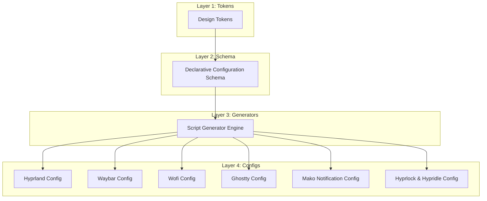
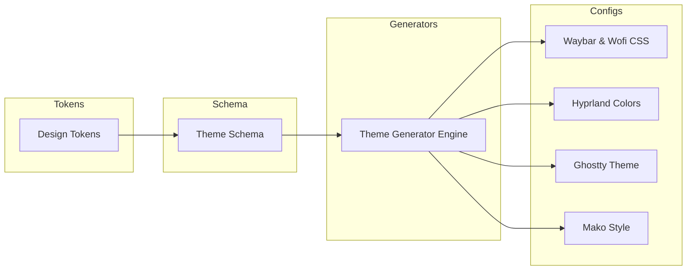

# AkumaOS Architecture

## Overview
AkumaOS is designed around a modular, decoupled architecture where design tokens, configuration schemas, script generator engines, visual assets, and theme templates are cleanly separated. This architectural design ensures maintainability, ease of customization, and predictable behavior across different hardware environments.

---

## Repository Layout & Folder Structure

```text
AkumaOS/
├── .github/              # Issue templates, PR templates, and CI workflows
├── assets/               # Branding assets, icons, previews, and screenshots
├── config/               # Compositor, bar, launcher, and daemon configurations
├── docs/                 # Product architecture, design system, installation & roadmap
├── schema/               # Declarative configuration schemas (theme, desktop, modules, keybinds)
├── scripts/              # System management, installation, and utility scripts
├── tests/                # Automated testing suites for configurations and installation
├── themes/               # Centralized theme definitions and design token specifications
│   ├── default/          # Default theme package base
│   └── tokens/           # Modular design token specifications (colors, spacing, etc.)
├── tools/                # Development, validation, and formatting tooling
└── wallpapers/           # Curated high-resolution wallpaper collections
```

### Folder Responsibilities

| Directory | Primary Purpose |
|---|---|
| `.github/` | Continuous integration workflows (linting, validation) and community contribution templates. |
| `assets/` | Static media assets including AkumaOS branding, logo vectors, screenshots, and UI previews. |
| `config/` | Application configuration subdirectories for Hyprland, Waybar, Ghostty, Hyprlock, Hypridle, Wofi, Mako, and SwayOSD. |
| `docs/` | Comprehensive technical documentation, architectural blueprints, design guidelines, and user manuals. |
| `schema/` | Declarative configuration schemas (`theme.schema.md`, `desktop.schema.md`, `modules.schema.md`, `keybinds.schema.md`). |
| `scripts/` | Shell entry points for installation, updates, bootstrapping, and environment switching. |
| `tests/` | Test suites for configuration syntax validation (`tests/config/`) and installer testing (`tests/install/`). |
| `themes/` | Central theme definitions (`themes/default/`) and abstract design token specifications (`themes/tokens/`). |
| `tools/` | Developer tools for repository validation (`tools/validate.sh`) and code formatting (`tools/format.sh`). |
| `wallpapers/` | Organized wallpaper categories (minimal, abstract, nature, anime) supplied with the desktop environment. |

---

## Configuration Pipeline & Flow Architecture

The AkumaOS configuration pipeline processes declarations through a structured, multi-tier flow:

```text
Tokens (themes/tokens/) → Schema (schema/) → Generators (scripts/ & tools/) → Native Configs (config/)
```



### Pipeline Stages:
1. **Tokens (`themes/tokens/`)**: Define raw visual design tokens (colors, spacing, typography, radius, shadows, blur, animations).
2. **Schema (`schema/`)**: Structures design tokens and user preferences into validatable YAML schemas (`theme`, `desktop`, `modules`, `keybinds`).
3. **Generators (`scripts/` & `tools/`)**: Parses YAML schemas and compiles native, application-specific configuration files.
4. **Native Configs (`config/`)**: Deploys compiled native configs to target applications via dynamic IPC reloads.

---

## Theme System Architecture

The AkumaOS theme system decouples visual styling from component configurations via the schema layer:



- **Declarative Schema**: Theme variables are validated against `schema/theme.schema.md`.
- **Dynamic Application**: Generator scripts compile these schemas into runtime configuration files for active desktop applications.

---

## Script Responsibilities

The `scripts/` directory contains executable entry points for environment lifecycle management:

- `bootstrap.sh`: Verifies dependencies, creates necessary symlinks to `~/.config/`, and initializes default state.
- `install.sh`: Automated installer script for setting up AkumaOS on a clean Linux system.
- `uninstall.sh`: Safe uninstallation script that restores pre-existing configuration backups.
- `update.sh`: Synchronizes local configuration with upstream repository updates while preserving user customizations.
- `wallpaper.sh`: Wallpaper switcher script that handles wallpaper selection, blur generation, and color synchronization.

---

## Wallpaper System Architecture

The wallpaper subsystem handles dynamic visual anchoring across the desktop environment:
- **Directory Organization**: Wallpapers are categorized into `wallpapers/anime/`, `wallpapers/minimal/`, `wallpapers/nature/`, and `wallpapers/abstract/`.
- **IPC Integration**: `scripts/wallpaper.sh` interfaces with Wayland wallpaper daemons to set background images seamlessly across multiple monitors.
- **Lock Screen Sync**: Automatically passes active wallpaper paths to `hyprlock` configuration for visual consistency.

---

## Installer Architecture

The AkumaOS installer is designed to be safe, idempotent, and non-destructive:


1. **Pre-flight Check**: Validates distribution compatibility, Wayland session support, and required binary dependencies.
2. **Backup System**: Automatically archives existing user configurations in `~/.config-backups/` before modifying files.
3. **Deployment**: Deploys modular symlinks or copies configuration files to `~/.config/`.
4. **Verification**: Checks service execution and environment variables before completing.

---

## Future Extensibility

AkumaOS architecture is designed for future extension:
- **Plugin & Module Integration**: Ability to drop custom Waybar modules or Wofi plugins without altering core system files.
- **Multi-Monitor Profiles**: Configurable display profiles managed via script extensions for laptop and multi-display desktop setups.
- **Custom Theme Packages**: Third-party themes can be placed in `themes/` and loaded via the standard switcher engine.
