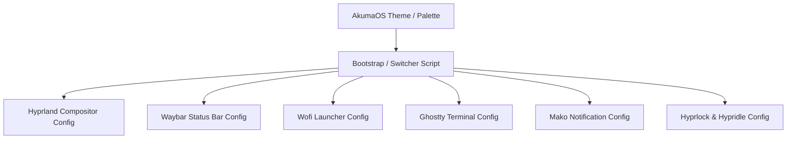
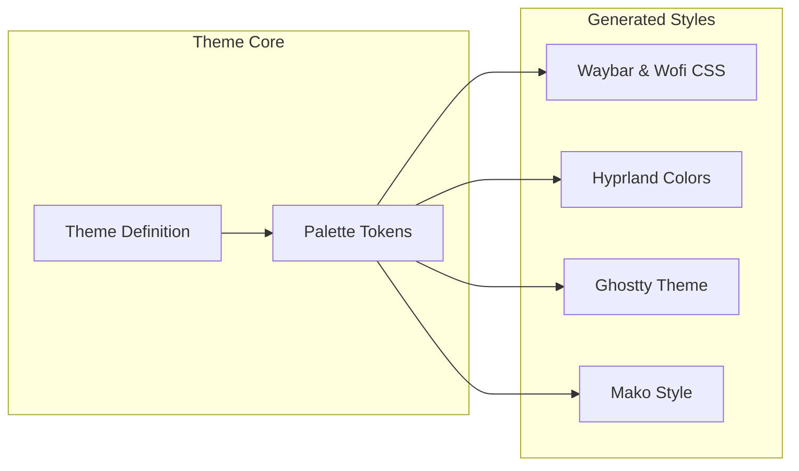

# AkumaOS Architecture

## Overview
AkumaOS is designed around a modular, decoupled architecture where configuration declarations, script engines, visual assets, and theme templates are cleanly separated. This architectural design ensures maintainability, ease of customization, and predictable behavior across different hardware environments.

---

## Repository Layout & Folder Structure

```text
AkumaOS/
├── .github/              # Issue templates, PR templates, and CI workflows
├── assets/               # Branding assets, icons, previews, and screenshots
├── config/               # Compositor, bar, launcher, and daemon configurations
├── docs/                 # Product architecture, design system, installation & roadmap
├── scripts/              # System management, installation, and utility scripts
├── tests/                # Automated testing suites for configurations and installation
├── themes/               # Centralized theme definitions and design token specifications
│   ├── default/          # Default theme package base
│   └── tokens/           # Modular design token specifications (colors, spacing, etc.)
├── tools/                # Development, validation, and formatting tooling
└── wallpapers/           # Curated high-resolution wallpaper collections
```

### Folder Responsibilities

| Directory | Primary Purpose |
|---|---|
| `.github/` | Continuous integration workflows (linting, validation) and community contribution templates. |
| `assets/` | Static media assets including AkumaOS branding, logo vectors, screenshots, and UI previews. |
| `config/` | Application configuration subdirectories for Hyprland, Waybar, Ghostty, Hyprlock, Hypridle, Wofi, Mako, and SwayOSD. |
| `docs/` | Comprehensive technical documentation, architectural blueprints, design guidelines, and user manuals. |
| `scripts/` | Shell entry points for installation, updates, bootstrapping, and environment switching. |
| `tests/` | Test suites for configuration syntax validation (`tests/config/`) and installer testing (`tests/install/`). |
| `themes/` | Central theme definitions (`themes/default/`) and abstract design token specifications (`themes/tokens/`). |
| `tools/` | Developer tools for repository validation (`tools/validate.sh`) and code formatting (`tools/format.sh`). |
| `wallpapers/` | Organized wallpaper categories (minimal, abstract, nature, anime) supplied with the desktop environment. |

---

## Configuration Flow Architecture

The AkumaOS configuration flow follows a centralized declaration model. Global variables and active theme tokens originate in the theme layer and script environment, propagating downstream to individual component configurations.



### Flow Lifecycle:
1. **Selection**: User or system triggers a theme, wallpaper, or layout change via `scripts/`.
2. **Parsing**: The script engine reads the central configuration tokens from `themes/`.
3. **Application**: Configurations in `config/` are updated or reloaded dynamically via IPC signals (e.g., `hyprctl reload`, `makoctl reload`).

---

## Script Responsibilities

The `scripts/` directory contains executable entry points for environment lifecycle management:

- `bootstrap.sh`: Verifies dependencies, creates necessary symlinks to `~/.config/`, and initializes default state.
- `install.sh`: Automated installer script for setting up AkumaOS on a clean Linux system.
- `uninstall.sh`: Safe uninstallation script that restores pre-existing configuration backups.
- `update.sh`: Synchronizes local configuration with upstream repository updates while preserving user customizations.
- `wallpaper.sh`: Wallpaper switcher script that handles wallpaper selection, blur generation, and color synchronization.

---

## Theme System Architecture

The AkumaOS theme system decouples visual styling from component configurations:



- **Centralized Tokens**: Color definitions, padding metrics, border radii, and font declarations are declared as standardized variables.
- **Dynamic Application**: Scripts parse these tokens to generate runtime configuration files or update environment variables for active desktop applications.

---

## Wallpaper System Architecture

The wallpaper subsystem handles dynamic visual anchoring across the desktop environment:
- **Directory Organization**: Wallpapers are categorized into `wallpapers/anime/`, `wallpapers/minimal/`, `wallpapers/nature/`, and `wallpapers/abstract/`.
- **IPC Integration**: `scripts/wallpaper.sh` interfaces with Wayland wallpaper daemons to set background images seamlessly across multiple monitors.
- **Lock Screen Sync**: Automatically passes active wallpaper paths to `hyprlock` configuration for visual consistency.

---

## Installer Architecture

The AkumaOS installer is designed to be safe, idempotent, and non-destructive:


1. **Pre-flight Check**: Validates distribution compatibility, Wayland session support, and required binary dependencies.
2. **Backup System**: Automatically archives existing user configurations in `~/.config-backups/` before modifying files.
3. **Deployment**: Deploys modular symlinks or copies configuration files to `~/.config/`.
4. **Verification**: Checks service execution and environment variables before completing.

---

## Future Extensibility

AkumaOS architecture is designed for future extension:
- **Plugin & Module Integration**: Ability to drop custom Waybar modules or Wofi plugins without altering core system files.
- **Multi-Monitor Profiles**: Configurable display profiles managed via script extensions for laptop and multi-display desktop setups.
- **Custom Theme Packages**: Third-party themes can be placed in `themes/` and loaded via the standard switcher engine.
